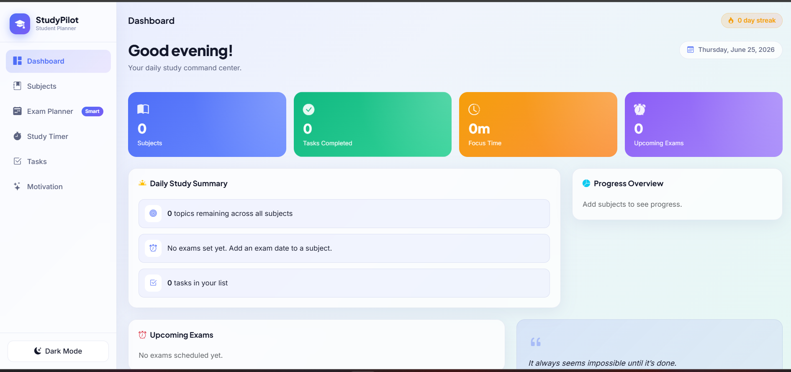

# StudyPilot - Smart Study Planner

StudyPilot is a modern student productivity application designed to help students manage subjects, exams, study sessions, and daily tasks efficiently.

## Features

* Dashboard Overview
* Subject Management
* Smart Exam Planner
* Pomodoro Study Timer
* Task Management
* Progress Tracking
* Daily Study Summary
* Motivation Section
* Dark Mode Support

## Technologies Used

* HTML
* CSS
* JavaScript

## Screenshot

## Purpose

This project was created to help students organize their studies, track progress, and improve productivity through smart planning tools.

## Author

Manahil Ahmed Khan

